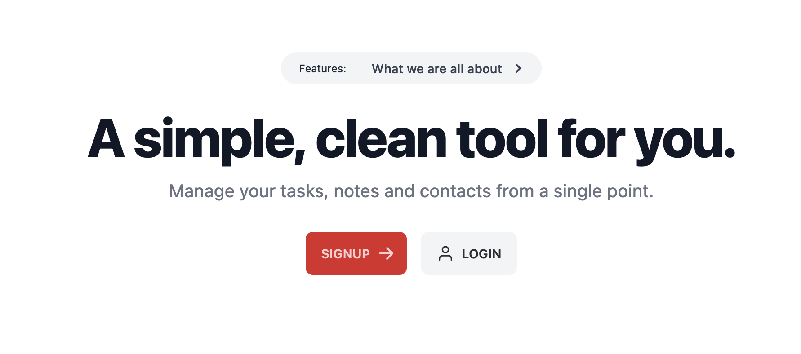

## LifeDash 

A simple single page application for managing your personal life. In early-stage development.

See the application live on [Ldash.me](https://ldash.me). Want to setup one of your own? Checkout our [documentation](https://github.com/mstdn/LifeDash/blob/main/docs/install.md).

### Build with:

- [Laravel 9.x](https://laravel.com/).
- [Vue JS 3.x](https://vuejs.org/).
- [Tailwind CSS 2.x](https://tailwindcss.com/).
- [Inertia.js](https://inertiajs.com/).

## Free, forever

Feel free to use however you like but please do not sell it. It is FREE for everyone! FOREVER. You can buy me a coffee if you like to thank me.

- [PayPal](https://paypal.me/stuxOS)
- [Ko-Fi](https://ko-fi-com/mstdn)
- [Patreon](https://patreon.com/mstdn)

## Code of Conduct

In order to ensure that the Laravel community is welcoming to all, please review and abide by the [Code of Conduct](https://laravel.com/docs/contributions#code-of-conduct).

## Security Vulnerabilities

If you discover a security vulnerability within Laravel, please send an e-mail via [stux@mstdn.social](mailto:stux@mstdn.social). All security vulnerabilities will be promptly addressed.

## License

The Laravel framework is open-sourced software licensed under the [MIT license](https://opensource.org/licenses/MIT).
